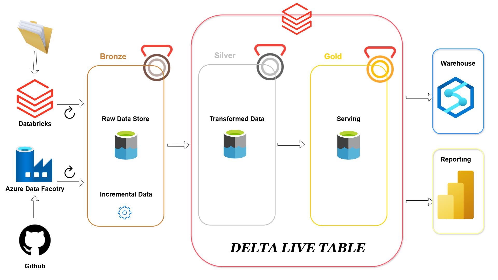

# 🎬 Netflix Metadata Pipeline with Azure Data Factory, Databricks, Delta Live Tables & Power BI

This project implements a robust **data engineering pipeline** to ingest, process, and serve Netflix metadata using **Azure Data Factory**, **GitHub**, **Databricks**, **Delta Live Tables**, and **Power BI**. The architecture follows the **Bronze → Silver → Gold** medallion pattern and leverages modern data lakehouse best practices.

---

## 📌 Overview

This pipeline enables:

1. 📥 **Ingestion** of Netflix metadata from CSV files via Azure Data Factory.
2. 🧊 **Storage** of raw data in the Bronze layer for lineage and auditing.
3. 🧪 **Transformation** with Delta Live Tables into a cleaned and enriched Silver layer.
4. 🏆 **Curation** of Gold datasets for business reporting and dashboards.
5. 📊 **Visualization** with Synapse Analytics or Power BI.

---

## 🧩 Architecture



* **GitHub**: Source of versioned ADF pipeline definitions.
* **Azure Data Factory**: Ingests CSV data into the data lake.
* **Databricks**: Executes transformation pipelines using Delta Live Tables.
* **Delta Lake**:

  * **Bronze**: Stores raw ingested data.
  * **Silver**: Holds cleaned and joined data.
  * **Gold**: Contains analytical, reporting-ready datasets.
* **Synapse Warehouse**: Optional SQL querying layer.
* **Power BI**: For dashboards and business reports.

---

## 📁 Ingested Files

The following folders contain CSV metadata from Netflix:

```python
files = [
    { "sourcefolder": "netflix_directors", "targetfolder": "netflix_directors" },
    { "sourcefolder": "netflix_cast",      "targetfolder": "netflix_cast" },
    { "sourcefolder": "netflix_countries", "targetfolder": "netflix_countries" },
    { "sourcefolder": "netflix_category",  "targetfolder": "netflix_category" },
]
```

### 📥 Bronze Layer (Raw Storage)

Each CSV is loaded into its respective path in the Bronze layer:

```
/bronze/
├── netflix_directors/
├── netflix_cast/
├── netflix_countries/
├── netflix_category/
└── netflix_titles/
```

---

## 🔁 Transformation with Delta Live Tables

Databricks processes the Bronze data using **Delta Live Tables** (DLT):

```python
@dlt.table
def bronze_netflix_directors():
    return (
        spark.read.format("csv")
             .option("header", "true")
             .load("/mnt/bronze/netflix_directors")
    )
```

Subsequent Silver and Gold transformations include cleansing, joins, and aggregation.

---

## 📂 Project Structure

```bash
.
├── RawData/
│   ├── netflix_directors.csv
│   ├── netflix_cast.csv
│   ├── netflix_countries.csv
│   ├── netflix_category.csv
│   └── netflix_titles.csv             # Raw metadata files related to Netflix content
├── notebooks/
│   ├── 1_Autoloader.ipynb             # Loads raw CSV files into the Bronze layer using Databricks Autoloader
│   ├── 2_silver(ParameterizedNotebook).ipynb  # Dynamically transforms specific datasets into a cleaner Silver format
│   ├── 3_lookupNotebookForSilver2.ipynb       # Handles lookup logic and joins between related datasets
│   ├── 4_Silver.ipynb                 # Consolidates and finalizes cleaned Silver-level data(Netflix_titles.csv)
│   └── 5_DLT_Notebook.ipynb          # Implements Delta Live Tables for structured and automated data flow to the Gold layer
├── Netflix Project.dbc               # Exported Databricks notebook bundle (for easy import)
├── assets/
│   └── Architecture.png              # Visual diagram of the full data pipeline architecture
└── README.md                         # Project overview and documentation

```

---

## 🚀 Deployment Guide

### ✅ Prerequisites

* Azure subscription (Data Factory, Databricks, Data Lake, Power BI)
* GitHub repo with pipeline JSON and notebooks
* Power BI Pro license
* Databricks with Delta Live Tables enabled


---

## 📊 Example Output

```
/silver/
├── cleaned_netflix_directors/
├── cleaned_netflix_cast/
....

 /gold/
└── netflix_dashboard_ready/
    ├── directors_by_country.parquet
    ├── cast_popularity_summary.parquet
    ....
```

---

## 📎 Tech Stack

* **Azure Data Factory**: Data orchestration
* **Azure Databricks**: Transformation and lakehouse management
* **Delta Lake + Delta Live Tables**: Streaming + batch ETL
* **Power BI**: Dashboarding and visualization
* **GitHub**: Version control for pipeline and code

---


